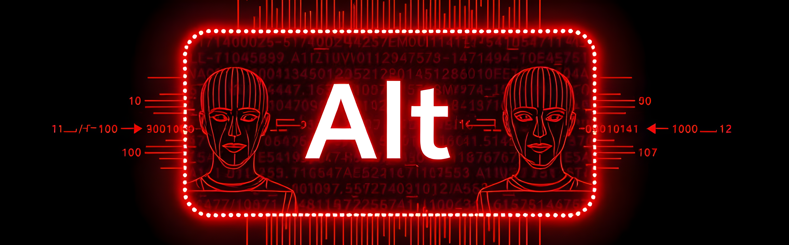

<p align="center">
  
</p>

---

# Alt Framework
TDLR: **Alt** is a Python framework for running concurrent tasks ("Agents") in their own processes with built-in monitoring, resource creation, and easy extensibility.

Welcome to the **Alt** GitHub repository! This project was designed to accelerate Python development, especially when handling multiple concurrent tasks. Inspired by our team's name, *The Matrix*, Alt is a matrix-themed framework that allows you to easily define "Agents"—entities that execute long-running tasks. Each Agent automatically receives its own resources, complete with built-in logging and monitoring. Additionaly, each agent gets its own process thread——The GIL wont slow down multiple agents running concurrently.

Thanks to the included extension packages, you can add new functionality to your Agents in just minutes.

[API Documentation (Coming Soon)](https://github.com/team488/alt)  
[Project Documentation (Coming Soon)](https://github.com/team488/alt)

## Getting Started
To use this project, you can either download the packages from pypi, or for the latest version clone this repository and then install it directly


### Pip Install:
```shell
    # Core packagae
    pip install Matrix-Alt-Core

    # extension packages
    # Cameras
    pip install Matrix-Alt-Cameras
    # Dashboard
    pip install Matrix-Alt-Dashboard
    # Object localization/Ml tasks
    pip install Matrix-Alt-ObjectLocalization
    # Pathplanning tasks
    pip install Matrix-Alt-Pathplanning
```

### Direct Install

``` shell
    # clone and enter to repo
    git clone https://github.com/Team488/Alt.git
    cd Alt

    # Core packagae
    pip install ./Alt-Core

    # extension packages
    # Cameras
    pip install ./Alt-Cameras
    # Dashboard
    pip install ./Alt-Dashboard
    # Object localization/Ml tasks
    pip install ./Alt-ObjectLocalization
    # Pathplanning tasks
    pip install ./Alt-Pathplanning


```


## Example: Blurring a Webcam Feed

Here's a simple example of reading from a webcam and applying a blur effect:

```python
import cv2
from Alt.Cameras.Agents import CameraUsingAgentBase
from Alt.Cameras.Captures import OpenCVCapture

class BlurAgent(CameraUsingAgentBase):
    def __init__(self):
        super().__init__(capture=OpenCVCapture("webcam", 0))

    def create(self):
        super().create()
        self.sigma = self.propertyOperator.createProperty("Blur.Sigma", 10)

    def runPeriodic(self):
        super().runPeriodic()
        # Automatically applies the blur on the next frame
        cv2.GaussianBlur(self.latestFrameMain, (5, 5), self.sigma.get())

    def getDescription(self):
        return "Apply Gaussian Blur"

if __name__ == "__main__":
    from Alt.Core import Neo

    n = Neo()
    n.wakeAgent(BlurAgent, isMainThread=True)
    n.shutDown()
```

As you can see, the boilerplate is minimal, and this is just a glimpse of the many features Alt has to offer!